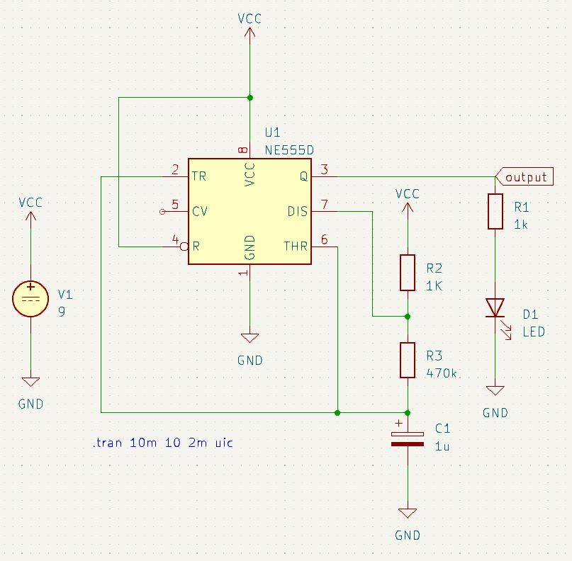

# KiCAD PCB Design

**Date**: June, 1st, 2023  
**Time**: IMiP Lecture 12:00-16:00  
**Place**: ACP SR1

## Ressources

## Before start
- Arduino/ESP Workshop at [Hackathon](hacktheparadise.jena.de) June 17th.
  - Join, Learn and Play Around!
  - Build little Sensor Applications
  - Programming microcontrollers
  - sending Data (WiFi, LORA)
  - Soldering, Akku welding
- first time workshop
  - stay calm!
  - please give feedback
- [Download](https://www.kicad.org/download/) KiCAD 7.x

## Theory
- What do we want? Electrical Connection!
  - conducting, mechanical stress, heat resistant
- Mechanical connection
  - Screws & Clamps
  - Breadboards
  - Wires & Clippers (Banana Clips)
  - Wire Wrapping
  - Soldering on Strip Boards
  - Sculptures for [real](https://www.eurocircuits.com/wp-content/uploads/detektor-radio-1948-258px-high.jpg) and [art](https://www.google.com/search?q=circuit+sculpture)
- PCB (Printed Circuit Boards)
  - Substrate (Fibre Glas, Epoxy Resin) (Flame Resistant)
  - etched Copper Layer (top, bottom, multilayers)
  - Holes with electroplating
  - Solder Mask
  - Surface Finish (ENIG)
  - Silk Screen
- Let's talk about stuff:
  - PCB Design in the early days
  - PCB Design today for everyone!
  - PCB Art
  - Flex PCBs
- Famous PCBs
  - Paul Eisler PCBs
  - Raspberry Pi
  - Arduino

- Software
  - Designing all the layers based on Schematic
  - KiCAD is a Software Suite:
    - Create Symbols for Components
    - Design Schematic
    - Create Footprints for Components
    - Generate netlist
    - Board Layout
    - Production
    - Generate BOM
  - it's an iterativ cyclic process! (Jumping back and forth)
  - KiCAD is not (particularly) for
    - Circuit Simulation
    - Heat and E/M field distribution
    - Fitting tests
- Startup KiCAD
  - Generate New Project / Folder
  - Get familiar with User Interface
    - Component and Footprint Libraries
    - Help

## Step 1 Schematic Design
- Open EESchema
- Configure Page Layout
  - Title
  - Rev
  - Date
  - Name
  - Licence etc.
- Scroll / Press Scroll for Zooming and Paning
- Add Component (A)
- Rotate (R), Move (M), Pull (G)
- Copy (C)
- Abort (Esc)
- Flags (GND, PWR)
- Wires (W)

### Build Blinking Light (LED Flasher)
- [Flashing LED](https://www.elprocus.com/wp-content/uploads/Blinking-LED-using-555-timer.jpg) based on 555 Timer
- Add Component NE555D
- Add three resistors, polarized condensators and a LED
- Add Voltage Source
- add VCC and GND flags
- wire everything up

### Import DigiKey Symbol Library
- open Schematic or Symbol Editor
- Preferences / Manage Symbol Libraries
- Global/Local
- Download Libraries from DigiKey [GitHub](https://github.com/Digi-Key/digikey-kicad-library)
- Add Library -> All files from Symbols

### Step Add Component Symbol
- open Symbol Editor
- File > New/Add Library (local/global)
- Add Box (with Text)
- Add Pins
  - In/Out
  - Direction
  - Label
- Insert new Symbol into Schematic

### Special Step Simulations in KiCAD with Spice
**555 Timer Simulation**

- add Spice Model to 555 Timer
- add Spice Model to Diode (QLP...)
- have values for every component
- have an id for every component
- add output flag
- .tran 1u 20m 2m uic directive

**Capacitor Load Cycle**
- add voltage supply (spice / VDC)
- add resistor and capacitor
- add reference point (0)
- VDC 15V, 100kOhm, 10uF
- .tran 0.1 10 uic directive

**Exercise** : Draw a schematic for a Laser Diode Driver (Constant Current Source) in KiCAD.

## Step 2 Assign Footprints
- **Option 1**
  - Run Footprint Assign
  - 555: Package-DIP, DIP-8W7.62
  - R: Resistor_THT, Axial
  - CP : Capacitor_THT, CP_Radial
- **Option 2**
  - Symbol Properties
  - Footprint
  - Library - Footprint

### Step Design your own Footprint
- open Footprint Editor
- File -> New/Add Libary
- New Footprint
- Add Pads
- Label Silkscreen
- Courtyard

### Install Footprint Library
- Open Footprint Editor
- Preferences -> Manage Footprint
- Global / Local
- Choose Folder from Downloaded from DigiKey [GitHub](https://github.com/Digi-Key/digikey-kicad-library)

**Exercise** : Assign all the footprints for your Laser Driver Circuit.

## Step 3 PCB Design
- open PCB Designer
- Tools, Views, Layers
- Page Setup
- Board Setup (Design Rules)
  - Tracks: 0.5, 0.3mm
  - Clearance etc. see Manufacturer     
- Tools > Update PCB from Schematic
- move parts (M, R)
- Mounting Holes Footprint
- Outline: Edge.Cuts
- Track (X)
- Track Layers (Set Via V)
- Backside: GND Layer
- Add Text (Front and Back)

### Images on your PCB!
- Open Image Converter
- measure size on PCB
- import image, change size
- Output Footprint
- Front Silk
- Export to File:
  - generate Pretty Folder
  - save file in Folder
- Open PCB Designer
- Preferences -> Manage Libraries
- add Footprint
- Decide Front/Back in Properties

### Advanced Art:
- import edge cut as graphic

- YouTube [Tutorial](https://www.youtube.com/watch?v=zjnwlTgil4A&ab_channel=StuartPatterson)

## Step 4 Generate Gerber Files and BOM

- Open PCB Designer
- File > Fabrication Output > Gerbers
- Generate Drill Files
- ZIP all gbr and drl files
- Done!

### Export 3D Model
- Open PCB Designer
- File > Export > STEP File
- Open STEP in FreeCAD

## Appendum
- List of KiCAD Extensions from [this](https://www.youtube.com/watch?v=eMdX3R9ni7g) YouTube Video
- **KiBuzzard**
  - nice Labels
  - [GitHub](https://github.com/gregdavill/KiBuzzard)
- **InteractiveHtmlBOM**
  - Exporter for a nice interactive HTML BOM  
  - [GitHub](https://github.com/openscopeproject/InteractiveHtmlBom)
- **KiKit**
  - automatic Panel Generator
  - Presets for common Manufacturers
  - [GitHub](https://github.com/yaqwsx/KiKit)
- **Footprint Generator**
  - Automatic Footprint Generation based on YAML File
  - [GitHub](https://github.com/pointhi/kicad-footprint-generator) 
- **KiCadStepUp**
  - read KiCad Files / Footprints into FreeCAD
  - push sketches to PCB edge cuts
  - [GitHub](https://github.com/easyw/kicadStepUpMod/)
- **PCB Checklist**
  - [GitHub](https://github.com/azonenberg/pcb-checklist/blob/master/layout-checklist.md) Checklist for PCB Design
