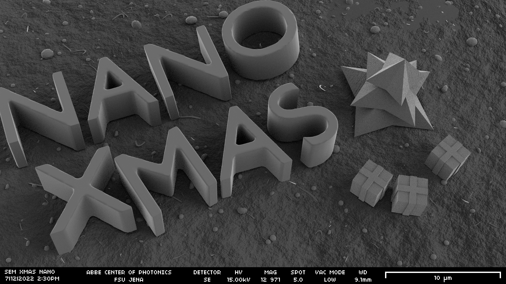
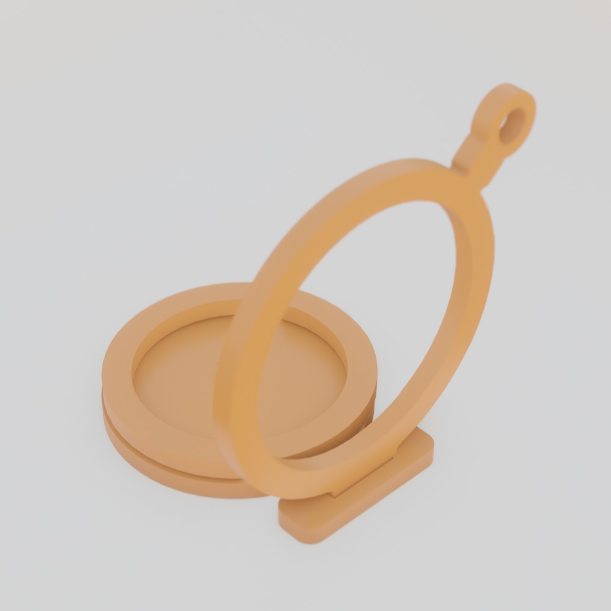
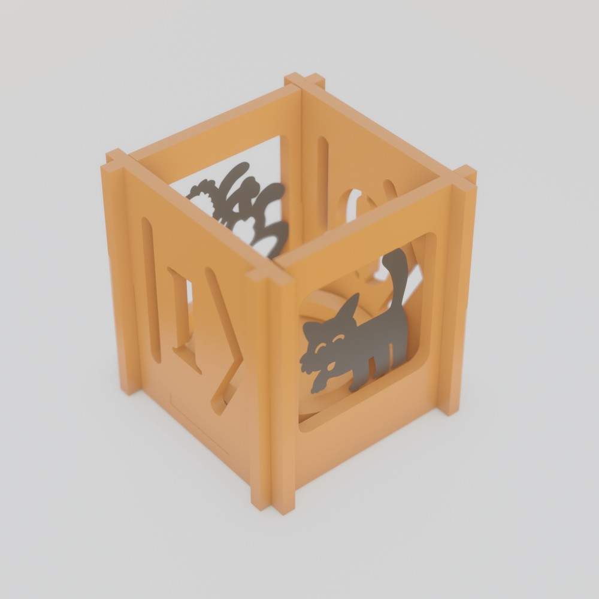

# XMas MAKER Projects

## Basic Rules
* Have fun!
* Be creative!
* Bring in your personality
  * culture
  * hobbies
  * research
  * memes
* Goal: Everyone builds something for Christmas Tree or Show Case.
* **Don't hesitate to ask someone from Lichtwerkstatt for help!**

## Materials
* black, white and red cardboard
* colored origami paper (20x20cm), shiny origami paper (10x10cm)
* tracing paper
* 4mm ply wood
* LED tea light candle (⌀38mm), CR2032 battery
* paper glue, wood glue and glue gun
* scissors, thread

## Vectorgraphics
* use a Vectorgraphic Program of your Choice
  * [Adobe Illustrator](https://www.adobe.com/de/products/illustrator.html) (contained in Adobe Cloud licence for FSU staff and students)
    * Illustrator for Scientists [PDF](https://www2.mrc-lmb.cam.ac.uk/groups/cartera/download/Illustrator-for-Scientists-A-Brief-Overview.pdf)
    * Illustrator Christmas Ornaments [YouTube](https://www.youtube.com/watch?v=2LMgF2GvWBE&ab_channel=SonduckFilm)
  * [Inkscape](https://inkscape.org/) (Open Source)
    * Inkscape Tutorial [Website](https://inkscape.org/learn/tutorials/)
    * Inkscape Basic Christmas Ornament [YouTube](https://www.youtube.com/watch?v=EAO-NTjMevw)
    * Inkscape Advanced Ornament [YouTube](https://www.youtube.com/watch?v=vl2D7ka4_8Q)
  * [Affinity Designer](https://affinity.serif.com/) (nice and cheap for Desktop and iPad)

## Beginner Tips&Tricks
* use primitive shapes and combine them with boolean operations
* use grid and automatic snap when designing interlocking parts
* use bitmaps(photos) to trace vector paths on top
* search for suitable graphics on the internet and trace them
* high-res black/white images are tracable automatically in Illustrator

## Lasercutter
* design your model in small parts and export in individual SVGs to facilitate using left-over material
* imports an SVG File
  * path contour or fill colors dont matter
  * path thickness doesnt matter
* dont forget to convert objects (especially text) into paths
* Lasercutter will cut EVERY path, so look out for
  * paths with no contour color
  * paths with no visible color (white)
  * paths with zero thickness
* wood has thickness of 4mm, plan intersecting pieces accordingly.
* cut your model in cardboard first if you're unsure 

# Projects

## XMas Tree Ornament
* [Template and Bloch Sphere Example](christmasTree_hanger)

Further links:
* Extensive Tutorial on [YouTube](https://www.youtube.com/watch?v=s6hlxlxbvPg&ab_channel=TheLaneLibraries)
* Example on [YouTube](https://www.youtube.com/watch?v=MlPlE84HQno&ab_channel=TheLaneLibraries)

### XMas Tree Picture Frame
* Take profile picture with your camera or search for famous person (Scientist)
* Vectorize contour
* Cut in Black Paper and glue on tracing paper

## Tea Light Holder
* [Single Sided](tealight_1sided) 
* [Quatro Sided](tealight_4sided) 
* [Schwibbsbogen](tealight_bogen)

## Moar Template Files!
* [3D Christmas Card] (misc/3dChristmasCard)  
* [3D Christmas Tree Decoration](misc/3dChristmasTreeDeko/) 
* [Christmas Flags](misc/ChristmasFlags/) 
* [Christmas Tree Bulbs](misc/ChristmasTreeBulbs/) 

## misc Projects
* Popup Card [YouTube](https://www.youtube.com/watch?v=3PHIyNMzrtk&ab_channel=FabLabOulu) (Inkscape, Lasercutter)
* Popup Card [Trotec Website](https://www.troteclaser.com/de/hilfe-support/hilfe-center/pop-up-karte-papier-erstellen) (Adobe Illustrator, Lasercutter) :de:
* PopupCard [Instructables](https://www.instructables.com/Popup-Cards-With-Laser-Cutter/)

## Projects without Lasercutting
* Origami Star [YouTube](https://www.youtube.com/watch?v=rOkAA6Fk0fc)
* Origami Tree [YouTube](https://www.youtube.com/watch?v=n8ICbk6Z8m0)
* 3D Paper Star [YouTube](https://www.youtube.com/watch?v=vT_aYYDsvtc)
* Easy Snowflake [YouTube](https://www.youtube.com/watch?v=7J2FcmWnMA4)
* Origami Ornaments [YouTube](https://www.youtube.com/watch?v=KtUxDOROZ0Q) [YouTube](https://www.youtube.com/watch?v=pGtUOPiDSXg)
* Origami SnowFlake [YouTube](https://www.youtube.com/watch?v=MbhlVfLtcaM)
* Origami Christmas Tree [YouTube](https://www.youtube.com/watch?v=OYXg0xq9A5M)